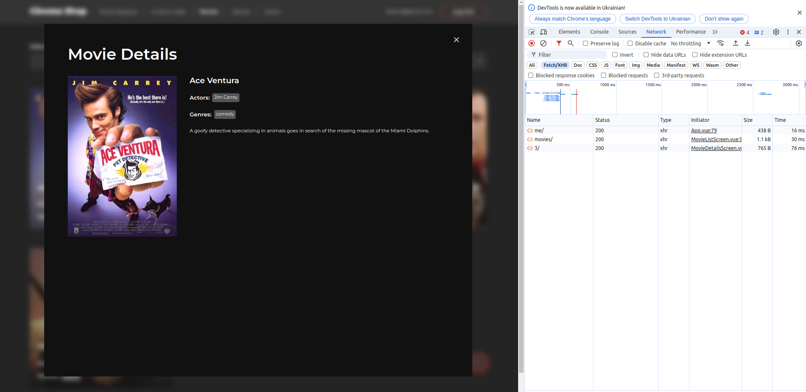
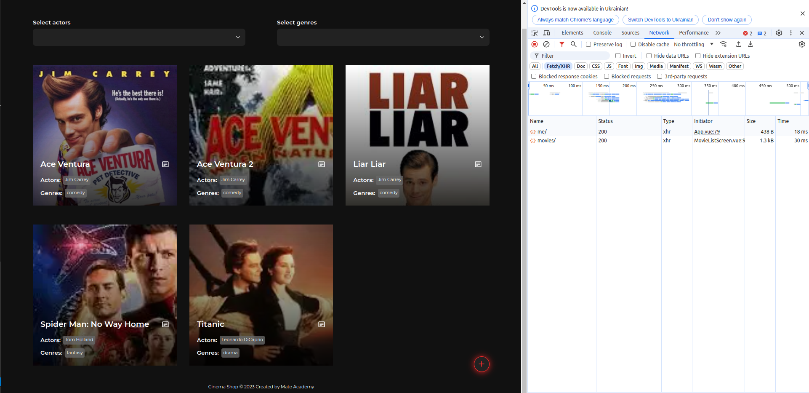

# Cinema Fullstack

- Read [the guideline](https://github.com/mate-academy/py-task-guideline/blob/main/README.md) before start

## Task:

You already have Backend and Frontend implemented.
You need to connect them together, and make sure all functionality of Cinema Shop works.

NOTE: Attach screenshots of all pages from the correctly connected frontend. Better to make them with opened developer tool, where will be shown requests to the API.

## Screenshots

